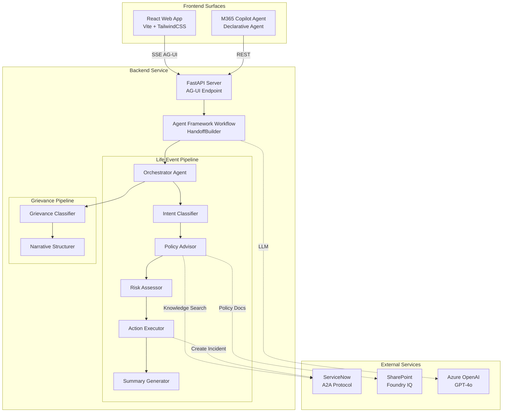
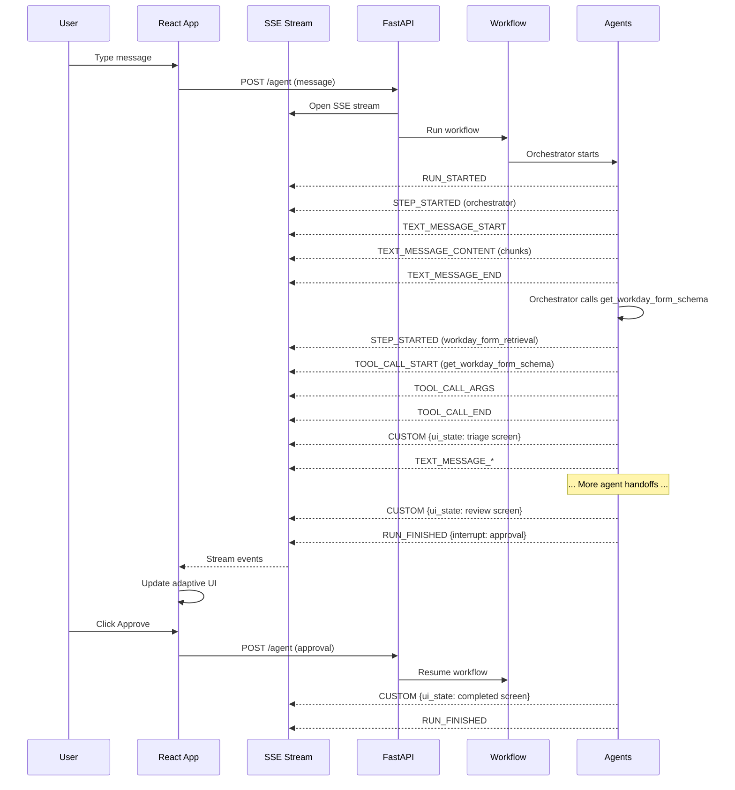
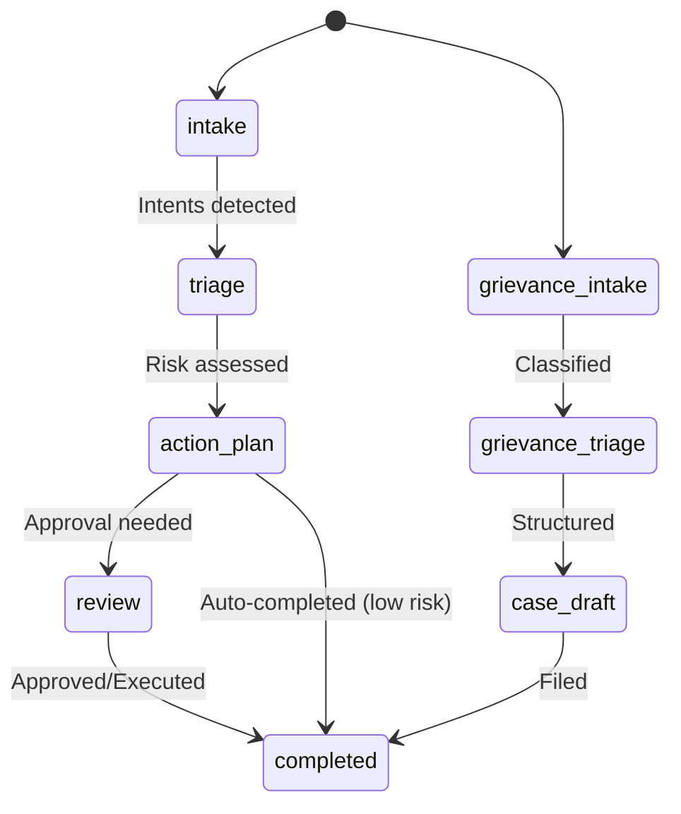

# Architecture Overview

## System Architecture

The HR Concierge demo is an **agentic orchestration system** built on three pillars:

1. **Microsoft Agent Framework** — Python SDK for defining agents, tools, and workflows
2. **AG-UI Protocol** — Server-Sent Events streaming for real-time UI updates
3. **Adaptive Generative UI** — React frontend that transforms based on workflow stage

## Component Diagram

## AG-UI Event Flow

## Data Flow

### Life Event Flow
1. **Intake** → User describes life event
2. **Intent Classification** → `classify_life_event` tool detects event type and affected fields
3. **Policy Retrieval** → `retrieve_policy_guidance` queries ServiceNow knowledge base
4. **Risk Assessment** → `assess_risk_and_compliance` evaluates each change
5. **Action Execution** → Low-risk: `execute_self_service_changes` / High-risk: `submit_high_risk_changes` (requires approval)
6. **Completion** → `generate_completion_summary` produces audit trail

### Grievance Flow
1. **Intake** → User describes workplace issue
2. **Classification** → `classify_grievance` determines type, severity, routing
3. **Structuring** → `structure_narrative` extracts facts, identifies gaps, creates case draft
4. **Review** → Case draft presented for HR review (human-in-the-loop)

## UI State Machine

## Technology Stack

| Layer | Technology | Purpose |
|---|---|---|
| Frontend | React 18 + TypeScript + Vite | SPA with adaptive UI |
| Styling | TailwindCSS + Framer Motion | Design system + animations |
| Streaming | EventSource (SSE) | AG-UI protocol client |
| Backend | FastAPI + Python 3.11 | API server + SSE endpoint |
| Orchestration | Microsoft Agent Framework | Agentic tool workflow |
| LLM | Azure OpenAI GPT-4o | Agent reasoning |
| Knowledge | ServiceNow A2A | HR knowledge base |
| Documents | SharePoint / Foundry IQ | Policy document grounding |
| M365 | Declarative Agent | Copilot integration |
